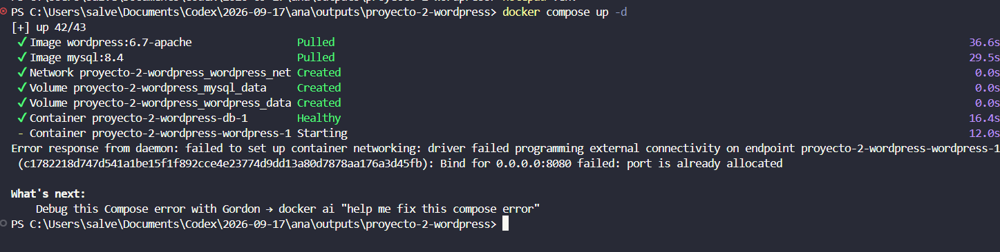
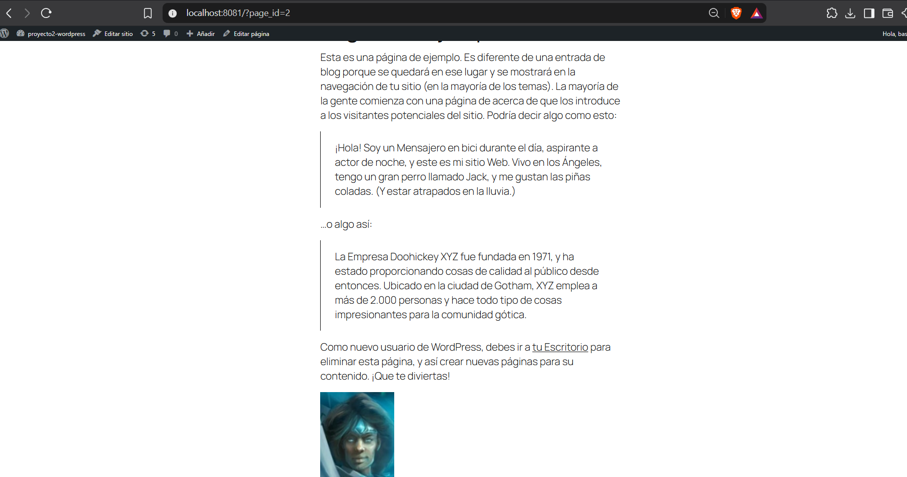
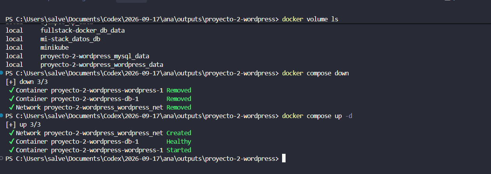

# Proyecto 2 - WordPress persistente con Docker Compose

Despliegue de un sitio WordPress con MySQL 8 mediante Docker Compose. La solucion usa servicios separados, volumenes nombrados para conservar datos, una red privada, configuracion mediante variables de entorno y un `healthcheck` para esperar a que MySQL este listo antes de iniciar WordPress.

## Tecnologias

- Docker y Docker Compose
- WordPress 6.7 con Apache
- MySQL 8.4

## Servicios

| Servicio | Imagen | Funcion |
| --- | --- | --- |
| `db` | `mysql:8.4` | Almacena la base de datos de WordPress. |
| `wordpress` | `wordpress:6.7-apache` | Publica el sitio web. |

## Requisitos

- Docker Desktop instalado y en ejecucion.
- Puerto local `8081` disponible.

## Configuracion

Copie el archivo de ejemplo y defina contrasenas propias:

```powershell
Copy-Item .env.example .env
notepad .env
```

El archivo `.env` no se versiona. Contiene el nombre de la base de datos, las credenciales de MySQL y el puerto de WordPress.

## Arranque

Desde la carpeta del proyecto ejecute:

```powershell
docker compose up -d
docker compose ps
```

Abra el sitio en [http://localhost:8081](http://localhost:8081) y complete la instalacion inicial de WordPress.

El puerto es `8081` porque el `8080` estaba ocupado por otro contenedor de WordPress. El cambio se realiza en `.env`:

```env
WORDPRESS_PORT=8081
```

## Volumenes, red y disponibilidad

Compose crea dos volumenes nombrados:

- `mysql_data`: conserva la base de datos MySQL.
- `wordpress_data`: conserva los archivos de `wp-content`, incluidos temas, complementos y archivos subidos.

Ambos servicios se conectan mediante la red privada `wordpress_net`. WordPress utiliza `db:3306` como host de base de datos; `db` es el nombre DNS estable del servicio dentro de la red de Compose.

El `healthcheck` ejecuta `mysqladmin ping` en MySQL. Con `depends_on: condition: service_healthy`, WordPress espera hasta que la base de datos este disponible; un `depends_on` simple solo ordena la creacion de contenedores y no garantiza que MySQL acepte conexiones.

## Prueba de persistencia

1. Cree una entrada o pagina de prueba en WordPress.
2. Detenga los servicios sin borrar los volumenes:

   ```powershell
   docker compose down
   ```

3. Inicelos nuevamente:

   ```powershell
   docker compose up -d
   ```

4. Abra otra vez el sitio. La entrada o pagina debe seguir disponible porque los datos quedaron almacenados en los volumenes nombrados.

Para consultar los volumenes:

```powershell
docker volume ls
```

> No utilice `docker compose down -v` durante esta prueba. La opcion `-v` elimina los volumenes y, con ellos, la base de datos y los archivos persistentes.

## Evidencias de funcionamiento

### Ajuste del puerto expuesto

Durante el primer arranque, el puerto `8080` estaba ocupado. Se identifico el conflicto y se configuro el puerto `8081` en `.env`, permitiendo iniciar el sitio sin afectar otros contenedores.



### Sitio WordPress accesible

El sitio quedo disponible en `http://localhost:8081`, con la pagina de ejemplo renderizada correctamente.



### Volumenes y reinicio de servicios

La consola muestra los volumenes `proyecto-2-wordpress_mysql_data` y `proyecto-2-wordpress_wordpress_data`. Despues de ejecutar `docker compose down`, los contenedores y la red se eliminaron, pero los volumenes se conservaron. Al ejecutar de nuevo `docker compose up -d`, MySQL alcanzo el estado `Healthy` y WordPress inicio correctamente.



## Comandos utiles

```powershell
docker compose ps        # Estado de los servicios
docker compose logs -f   # Registros en tiempo real
docker compose down      # Detiene y elimina contenedores y red, preserva volumenes
docker compose down -v   # Elimina tambien los volumenes: usar solo si se desea reiniciar todo
```

## Respuestas de reflexion

**¿Que comando elimina tambien los datos?** `docker compose down -v`, porque elimina los volumenes nombrados que guardan MySQL y `wp-content`.

**¿Por que WordPress se conecta a `db` y no a una IP?** Porque Docker Compose proporciona resolucion DNS por nombre de servicio dentro de la red. La IP de un contenedor puede cambiar, pero el nombre `db` se mantiene.

**¿Que aporta el healthcheck?** Comprueba que MySQL esta listo para recibir conexiones. Asi se evita que WordPress falle por intentar conectarse demasiado pronto.
